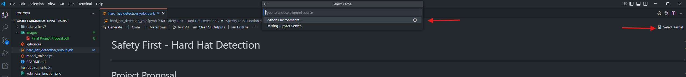
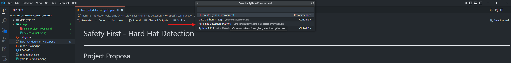
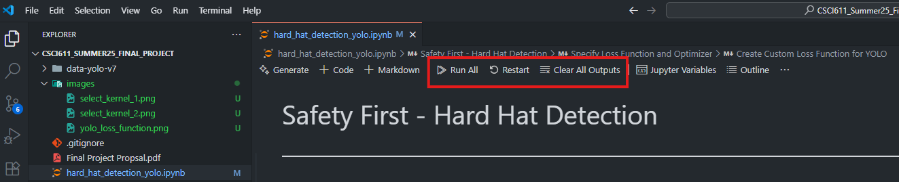

# CSCI611_Summer25_Final_Project

Go to the [link](https://docs.google.com/document/d/1XkK2IiD0MSFE1cAAt-i77VEGJz4t3srLGbuQ16GiV7c/edit?usp=sharing) for project proposal.

## Data Set

The data set comes from roboflow's [Hard Hat Workers Dataset](https://public.roboflow.com/object-detection/hard-hat-workers). We are using the Yolo V7 version.

## How To Run

### Pre-requisite

1. Follow [this link](https://code.visualstudio.com/Download) to download and install VS Code
1. Follow [this link](https://www.anaconda.com/download) to download and install Anaconda
1. Open your terminal and run the following command to create the conda environment for this project
    1. `conda create -n hard_hat_detection python=3.12.4`
1. Activate the conda environment
    1. `conda activate hard_hat_detection`
1. Install the required packages
    1. `pip install -r requirements.txt`
    1. `conda install pytorch torchvision -c pytorch`

### Run the Jupyter Notebook

1. Open the [hard_hat_detection_yolo.ipynb](./hard_hat_detection_yolo.ipynb)
1. Select the newly created conda environment as the kernel in VS Code
    1. 
    1. 
1. Click on `Clear All Outputs` and then `Restart` to start a fresh run
1. Click on `Run All` to run the entire notebook
    1. 
