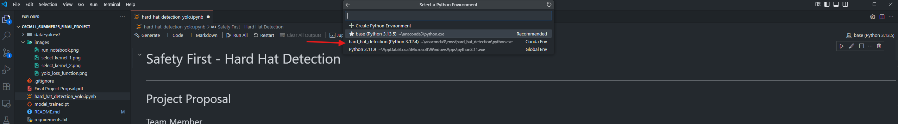

# CSCI611_Summer25_Final_Project

## Documents

[Project Proposal](./assets/Final%20Project%20Propsal.docx)

[Final Test Results](./assets/Hard%20Hat%20Detection%20Yolo%20Results.xlsx)

[Final Report](./assets/Final%20Report.docx)

[Final Presentation](./assets/Final%20Presentation.pptx)

[Final Presentation Recording](./assets/Final%20Presentation%20Recording.mp4)

## Data Set

The data set comes from roboflow's [Hard Hat Workers Dataset](https://public.roboflow.com/object-detection/hard-hat-workers). We are using the Yolo V7 version.

## How To Run

### Pre-requisite

1. Follow [this link](https://code.visualstudio.com/Download) to download and install VS Code
1. Follow [this link](https://www.anaconda.com/download) to download and install Anaconda
1. Open your terminal and run the following command to create the conda environment for this project
    1. `conda create -n hard_hat_detection python=3.11.13`
1. Activate the conda environment
    1. `conda activate hard_hat_detection`
1. Install the required packages
    1. `conda install pytorch torchvision opencv cudatoolkit=11.8 ipykernel -c pytorch -c nvidia`
    1. `pip install -r requirements.txt`

### Run the Jupyter Notebook

1. Open the [hard_hat_detection_yolo.ipynb](./hard_hat_detection_yolo.ipynb)
1. Select the newly created conda environment as the kernel in VS Code
    1. 
    1. 
1. Click on `Clear All Outputs` and then `Restart` to start a fresh run
1. Click on `Run All` to run the entire notebook
    1. 
